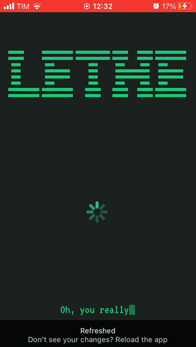
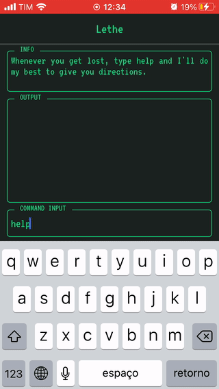
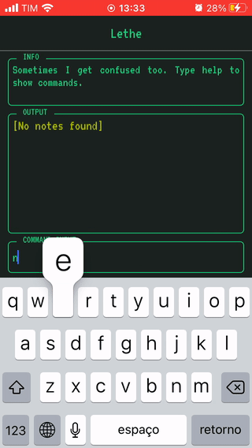
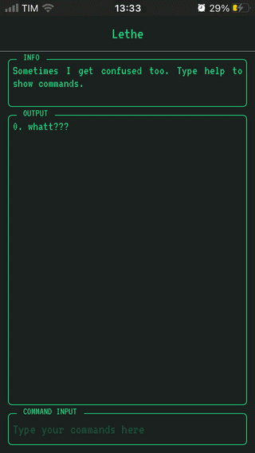
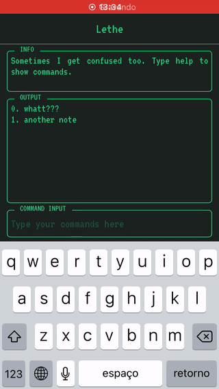
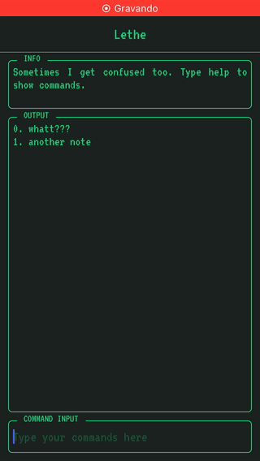
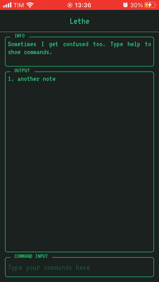

<h1 align="center">
  LETHE
</h1>

A 'terminal-like' app for taking notes that features an assistant who may be in three different moods: happy, indifferent and angry (>'-')>

<div style="color:#333333">

### 😶 What's the goal of this project?

This application was developed as an assignment for the mobile development course from the Systems Analysis and Development graduation course of the Federal University of Parana. The objective is practice react native and more specific the context API.

The requirements of this project involves:
- Create an app that implements CRUD functions on simple text notes
- The text notes must be stored in context
- It's not necessary to persist data or authenticate the user
- Use functional components and hooks
### 🖥 How do these stuff work?

The application was made using ```expo init```. The only libraries were [React]https://pt-br.reactjs.org/), [React-Native](https://reactnative.dev/), [React-Navigation](https://reactnavigation.org/) and everything that comes with [Expo](https://expo.io/).
The application works by inputing commands in the Input section of the app. Some example of commands are:
``` 
help: Lists available commands;
list: In the Home Screen lists all existing notes
rmall: Deletes all notes
```
The application provides two main screens: Home Screen and Note Screen. In the Home Screen the user can do stuff like lists notes, create a new note, remove a note, select a specific note to exhibit it's details and remove all notes. In the Note Screen the user can view the note in details, edit the note, change it's title, save the note, delete the note and clear the note.   

When the user creates a note, it can choose a title by typing as an argument to the command or not type and then getting a very cool random title. Every note created from scratch comes with a very tiny random piece of text that can be erased and modified as the user wish.

It's important to consult the help menu to get information about typing the commands, as there are some commands that require an aditional argument, others accept optional arguments and others can't accept arguments.

Every command generates some sort of feedback to the user. For example, if the user types an invalid command, the application's assistant will inform and suggests something.

About the simple assistant embedded in the application. The assistant have some kind of mood. It can be happy, indifferent or angry. The mood reflects in the way it outputs the messages to the user. The core infos of the messages are always displayed, so the assistant's mood will not harm the quality of the information. This is just something to have some fun :)

### 🔭 Overview of the application

Fig 1 - Splash screen



Fig 2 - Basic command input



Fig 3 - Creating an untitled note



Fig 4 - Creating a titled note



Fig 5 - Editing existing note



Fig 6 - Deleting a note in the Note Screen



Fig 7 - Deleting all notes



### 🚜 What is under the hood?

Is just a React Native App build with Expo framework that uses React Navigation
#### General
- [NPM](https://www.npmjs.com/)
- [React](https://pt-br.reactjs.org/)
- [React-Native](https://reactnative.dev/)
- [React-Navigation](https://reactnavigation.org/)
- [Expo](https://expo.io/)

> Note: Make sure you have Node v12.* or above, NPM in command line and the Expo CLI
### 🎛 So... How to set up the environment?

As mentioned before, it's required to have Node with version 12 or above, NPM in command line and Expo CLI.

There are basically two steps to make everything work:
1.Install the dependencies
2.Start the App

The steps can be done as follows:

```bash
# In the root directory of the application:
$ npm install       # This will download and install all of the dependencies
$ expo start        # This will start the application 
```

After that the application will be available through the Metro Bundler and the user can run it in the Android or iOS emulator or on physical devices.

</div>